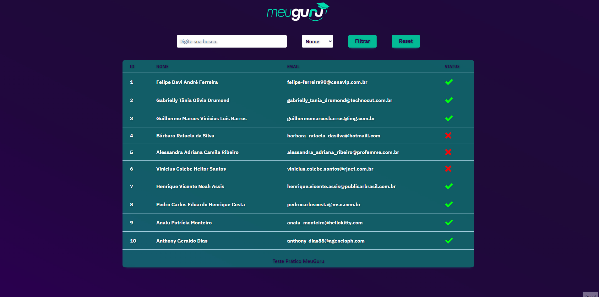

# Teste Prático MeuGuru

O teste prático tinha como objetivo o desenvolvimento de uma aplicação fullstack, para o cadastro de usuários. contendo um crud completo, com a parte de listagem feita através de paginação com filtros.

## Demo



# Aplicação


## Backend

Backend desenvolvido utilizando express, prisma e postgres. possui 4 endpoints sendo possível listar, criar, atualizar e deletar usuários.
Na parte de criação todas as senhas são criptografas antes de ser armazenadas no banco de dados utilizando a biblioteca argon2.
A parte de delete foi feita utilizando um middleware de Softdelete do próprio prisma.
Na listagem é possível ser feita com ou sem filtros, ambas contando com paginação offset.

## Frontend

Frontend foi feito com nextjs, realizando a tarefa de listar os usuários através de uma tabela sendo possível efetuar buscas com por nome ou email.

# Executando

## Rodar Localmente

Para rodar a aplicação você pode escolher entre rodar através de um container no docker ou localmente com node.

<details>
<summary><b>Docker</b></summary>

## Pré-Requisitos

Para rodar a aplicação é necessário ter instalado corretamente o [Docker](https://docs.docker.com/get-docker/) e o [Docker-Compose](https://docs.docker.com/compose/install/).

## Rodando no Docker

Clone o projeto

```bash
  git clone git@github.com:fpdsjr/teste-pratico-meu-guru.git
```

Navegue até o diretório do projeto

```bash
  cd teste-pratico-meu-guru
```

Rode a aplicação no docker

```bash
  docker-compose up -d --build
```

Apos conclusão da montagem do container a aplicação vai estar disponível nos endereços abaixo:

```bash
  Frontend: http://localhost:3000
  Backend: http://localhost:4000
```

</details>

<details>

<summary><b>Node</b></summary>

## Pré-Requisitos

Para rodar a aplicação é necessário ter instalado o [Node](https://nodejs.org/en/) e um banco de dados funcionando [PostgreSQL](https://www.postgresql.org/)

## Rodando no Node

O Projeto conta com um repositório monorepo utilizando yarn workspaces, e turborepo, para ligar o projeto so precisamos fazer o build e depois o start. veja abaixo:

Clone o projeto

```bash
  git clone git@github.com:fpdsjr/teste-pratico-meu-guru.git
```

Navegue até o diretório do projeto

```bash
  cd teste-pratico-meu-guru
```

Instando as dependências

```bash
  npm install
```

Precisamos dar o build no turborepo. fazendo isso o build é aplicado tanto pro backend como pro frontend

```bash
  yarn build
```

Agora para rodar o projeto no modo de produção já integrado e funcionando.

```bash
  yarn start
```

## Pronto agora o projeto já está rodando.

```bash
  Frontend: http://localhost:3000
  Backend: http://localhost:4000
```


</details>

## Rodando os testes

<details>
<summary><b>Turborepo</b></summary>


Para rodar os testes no turborepo so precisamos de um banco de dados de teste para os teste de integração, seguindo os passos abaixo com docker fica muito simples.

Entre no diretório raiiz

```bash
  cd teste-pratico-meu-guru
```

Entre na pasta apps

```bash
  cd apps
```

Entre na pasta server

```bash
  cd server
```

Aqui ligaremos o banco de dados de testes.

```bash
  docker-compose -up
```

Pronto agora so voltar para a raiz do projeto e rodar os testes com um yarn test e tanto os testes de backend e frontend serão executados.


```bash
  yarn test
```


</details>


# Tech Stack

#### Web

- React
- Nextjs
- CharkaUi
- ContextApi
- TypeScript
- React Hooks
- Custom Hooks
- Styled-Components
- Docker
- Axios
- Eslint
- Jest
- Husky
- Prettier
- Lint-Staged

#### Server

- Node
- CI
- TypeScript
- Express
- Prisma
- PostegreSQL
- Argon2
- Swc
- Docker
- Eslint
- Husky
- Prettier
- Lint-Staged
- Supertest
- Jest
- Tsyringe

## Authors

- [Flavio junior](https://github.com/fpdsjr)


